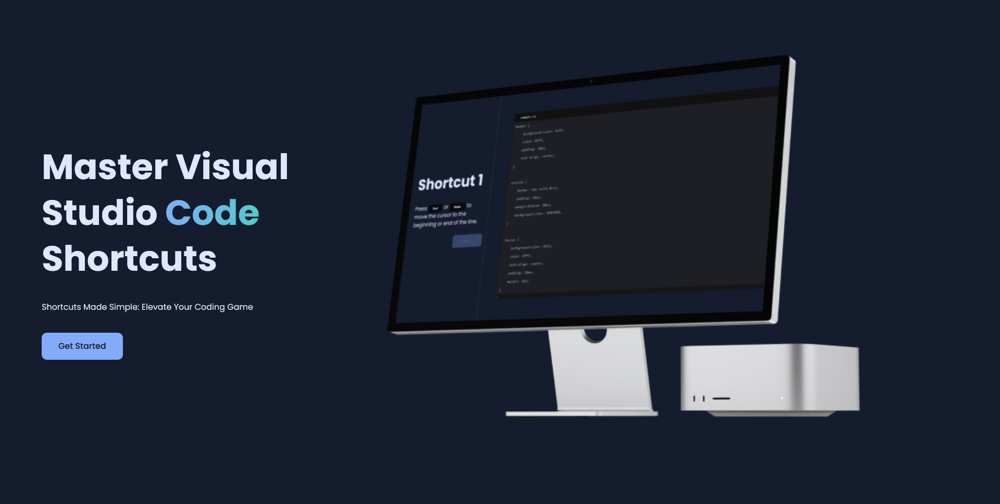

<div align="center">
    
    


### Shortcut Mastery
🚀 Master Visual Studio Code shortcuts and supercharge your coding productivity!

</div>

- [Overview](#features)
- [How To Use](#how-to-use)
- [Technologies](#technologies)
- [License](#license)

## Features

- 🎓 Interactive lessons for learning essential VS Code shortcuts.
- 💻 Hands-on coding practice with real-time feedback.
- 🚀 Elevate your coding speed and efficiency.
- 🌐 Web-based platform for accessibility from anywhere.

## How To Use
Visit the website https://shortcut-mastery.netlify.app

or

Clone and run this application, you'll need [Git](https://git-scm.com) and [Node.js](https://nodejs.org/en/download/) (which comes with [npm](http://npmjs.com)) installed on your computer. From your command line:

```bash
# Clone this repository
$ git clone https://github.com/LarsWeyen/shortcut-learner.git

# Go into the repository
$ cd shortcut-learner

# install dependencies
$ npm install

# Run the app
$ npm run dev
```

## Technologies

- **React**
- **Vite**
- **React-Router-Dom**

## License

This project is licensed under the MIT License.